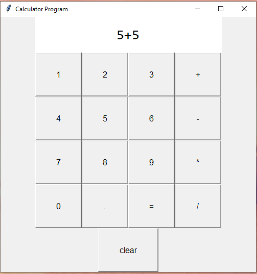

# A Simple Python Calculator

This is a simple Python calculator application. This project provides a basic graphical user interface for performing arithmetic calculations.

## Features
- Supports addition, subtraction, multiplication, and division.
- Handles decimal numbers.
- Allows you to clear the input and see the result.

## Installation
This application can be run by executing the `Calculator.py` script. To run the application, make sure to have Python installed, and simply run the script.

## How It Works
- **Tkinter**: The graphical user interface is created using the Tkinter library.
- **eval Function**: The calculator evaluates the mathematical expression entered by the user using the `eval` function.

## Project Files
- `Calculator.py`: The source code for the calculator application.
- `Calculator.png`: A screenshot of the calculator in action.

This project is a simple exercise in creating a basic calculator using Python and Tkinter.
